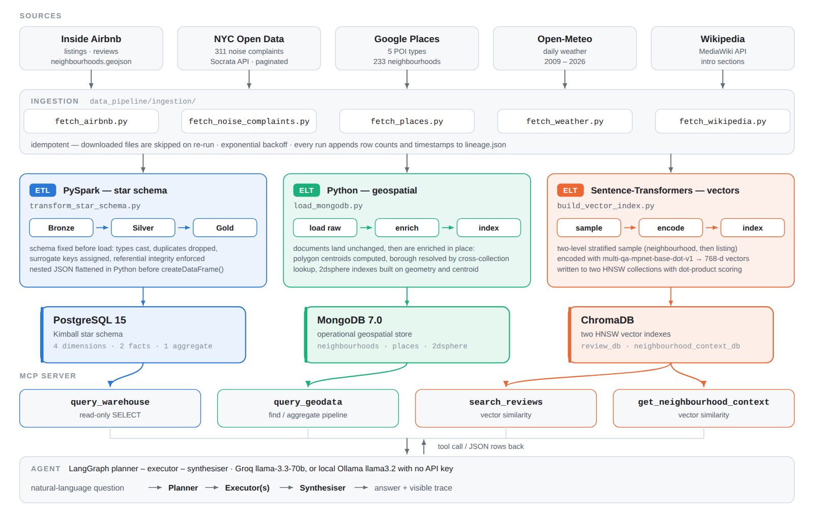
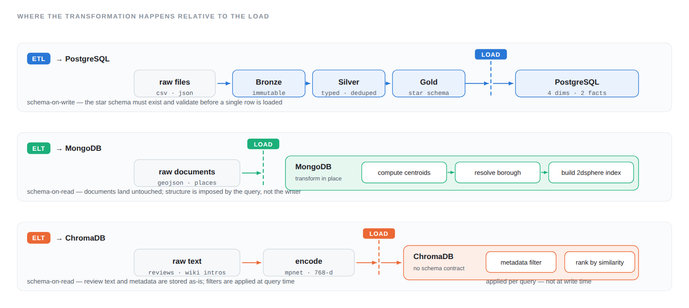
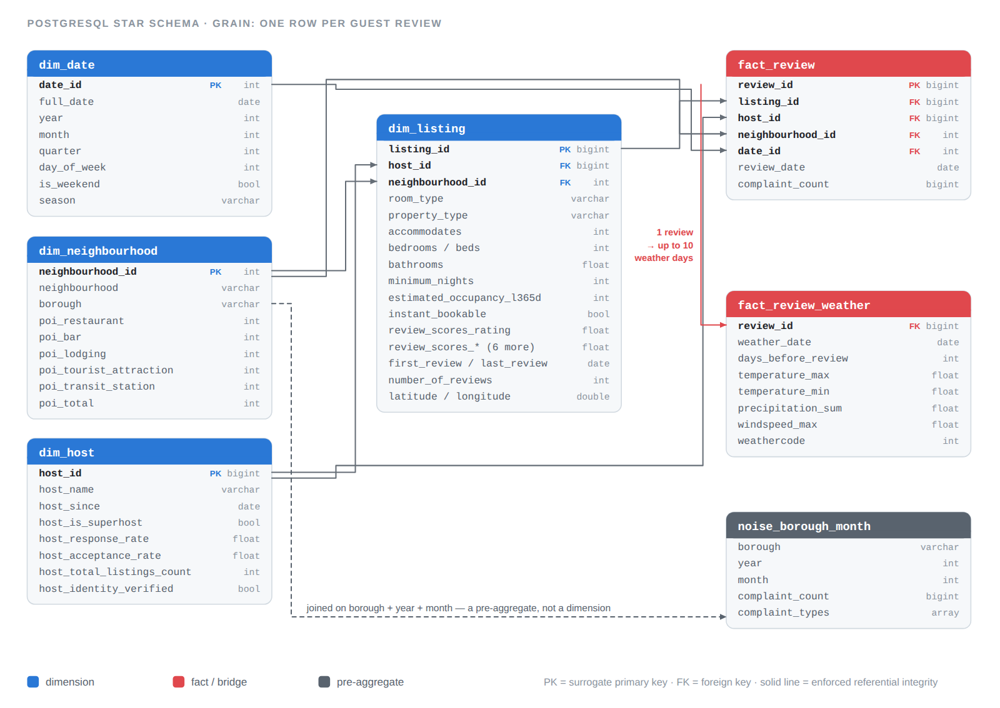
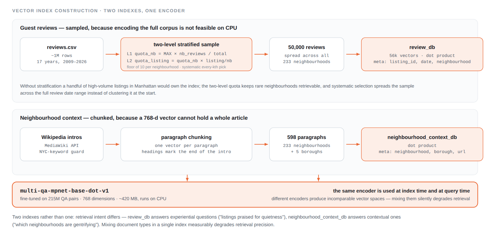
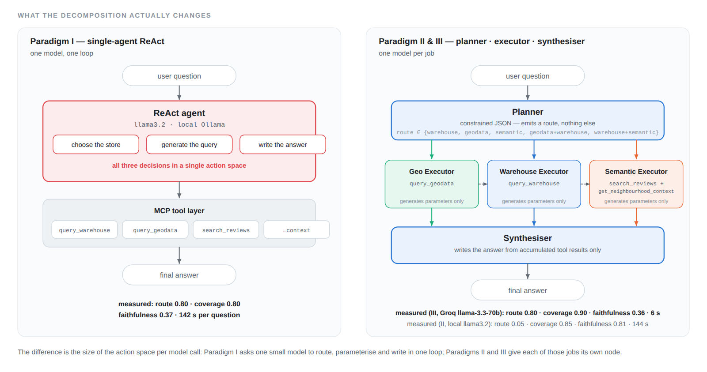
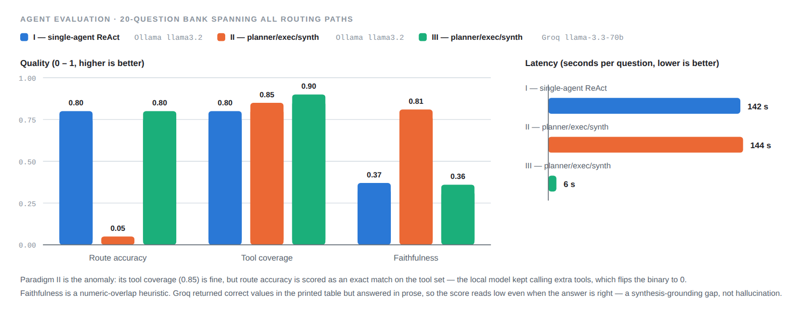

# NYC Airbnb Polyglot Analytics Platform

**Three storage paradigms behind one natural-language interface, so that structured
metrics, geometry and free text can each live in the store built for them and still be
queried in a single question.**

Five external sources — Inside Airbnb, NYC 311, Google Places, Open-Meteo and Wikipedia —
are ingested by idempotent scripts and fan out into three transformation paths: a PySpark
ETL into a PostgreSQL star schema at review grain, an ELT into a MongoDB geospatial store,
and an ELT into two ChromaDB vector indexes. All three are exposed to an LLM agent as four
read-only MCP tools.

Three orchestration paradigms were evaluated on a 20-question bank. Decomposing the agent
into planner, executor and synthesiser nodes lifted tool coverage from 0.80 to 0.90 and cut
latency from 142 s to 6 s. The remaining gap is not routing or retrieval — it is synthesis
grounding, and the metric that exposes it turns out to be measuring something other than
what its name suggests.

---

## The problem

What drives the performance of a short-term rental is spread across data that does not
share a shape. Occupancy and review scores are numeric and aggregation-heavy. Whether a
listing sits within 500 m of a subway station is a geometry question. What guests actually
complain about exists only as free text.

Force all three into one relational schema and two of them are served badly: geometry gets
serialised into text columns and loses its native operators, review text gets a `LIKE`
clause instead of semantic search. Keep them in three stores and the analyst has to know
which one to query, and in which dialect.

This project takes the second option and removes its cost, by putting one agent in front of
all three.

> **A question that needs all of them.** *"Which Brooklyn neighbourhoods have the
> highest-rated restaurants nearby, and what do guests say about noise there?"* — a
> `$geoNear` aggregation in MongoDB, a `GROUP BY` over the PostgreSQL star schema, and a
> vector search over the guest-review index, composed into one answer.

---

## Architecture



The three paths differ in one respect that determines everything else about them: *where*
the transformation happens relative to the load.

| Path | Pattern | Why | Target |
|------|---------|-----|--------|
| Listings, reviews, weather, noise, POI counts | **ETL** — PySpark, Bronze → Silver → Gold | The target is a fixed star schema; types, surrogate keys and referential integrity must hold *before* the load | PostgreSQL 15 |
| Neighbourhood boundaries, Places documents | **ELT** — load raw, enrich in place | GeoJSON polygons are stored natively; a relational schema would serialise the geometry and lose `$geoWithin` / `$nearSphere` | MongoDB 7.0 |
| Guest reviews, Wikipedia neighbourhood intros | **ELT** — encode, then index | There is no schema to enforce; metadata is filtered at query time alongside vector ranking | ChromaDB |



The dashed line is the load. Everything left of it happens before the data reaches the
store; everything right of it happens inside it. That position is the whole ETL/ELT
distinction, and it is decided by the target rather than by preference.

### Ingestion

Five scripts, one shared contract. Each is **idempotent** — already-downloaded files are
skipped on re-run — and each appends to a `lineage.json` recording the source, resolved
URL, destination, status and timestamp, so a suspicious row count downstream can be traced
to the run that produced it.

| Source | What it adds | Notes |
|--------|--------------|-------|
| **Inside Airbnb** | Listings, hosts, occupancy, review scores, review text, boundary polygons | Snapshot URLs are not stable, so the script *discovers* then downloads: BeautifulSoup parses the index page for every NYC archive link. Adding a year or a second city needs no code change. |
| **NYC 311** | Noise complaints — the most common negative theme in reviews | Socrata API, 50,000 records per page with an app token (1,000 without). Date range derived from the review dates, not hardcoded. |
| **Google Places** | Restaurants, bars, lodging, tourist attractions, transit | Places has no neighbourhood parameter, so boundary polygons are reduced to centroids and searched at a 1,000 m radius across five types × 233 neighbourhoods. |
| **Open-Meteo** | Daily temperature, precipitation, wind | A review is written *after* a stay, so the weather on the review date is not what the guest experienced. A 10-day look-back window is used instead. |
| **Wikipedia** | Neighbourhood history, gentrification, character | Intro section only, via the MediaWiki API. Early runs returned the right *name* in the wrong city, so a keyword guard rejects any intro not mentioning New York. |

That 10-day look-back is the reason weather cannot be a column on the fact table.

### The star schema



The queries this data invites are aggregation-heavy — averages by borough, counts by room
type, occupancy by season — which is what a star schema is for. Denormalised dimensions
mean those queries avoid repeated joins.

**The grain is one row per guest review**, not one per listing. Per-review is the finest
level available, and it is what makes review-time context joinable at all.

**Host and neighbourhood stay separate dimensions.** Both could have been folded into
`dim_listing`, but a single host may own many listings — full denormalisation would
duplicate every host attribute across every listing row, inviting update anomalies.

**`fact_review_weather` is a Kimball bridge.** Each review maps to up to ten days of
preceding weather. A single fact row cannot hold that without either collapsing it to one
aggregate or creating wide sparse columns, and both destroy information. Daily granularity
is preserved deliberately, so downstream queries pick their own aggregation — mean
temperature, count of rainy days — rather than inheriting one baked in at transformation
time.

`noise_borough_month` is the one deliberate non-star element: complaints have no
listing-level identity, so there is nothing to key them to, and they are joined on borough,
year and month.

Three of the five sources arrive as nested JSON — weather as parallel arrays keyed by date,
noise wrapped in a Socrata envelope, Places grouped by type with coordinates nested in a
`geometry` object. All three are flattened in Python before `spark.createDataFrame()`,
because Spark cannot enforce types on a structure it has not unpacked. PySpark rather than
pandas because the bridge table alone is roughly 9.7 M rows.

### Geospatial

PostgreSQL could do this through PostGIS. It does not here, for two reasons: analytical
aggregation and spatial proximity are different query profiles, and keeping them in
separate stores means neither competes with the other for the same index and buffer budget;
and MongoDB stores GeoJSON polygons natively, where a relational schema would serialise
them into text and lose operator support.

`$geoWithin`, `$near` and `$nearSphere` run against a `2dsphere` index using geodesic
distance. Across the ~60 km span of the five boroughs the curvature is small but not
negligible, and `$nearSphere` returns metres along the Earth's surface rather than a
Euclidean approximation.

```python
pipeline = [
    {"$geoNear": {
        "near": {"type": "Point", "coordinates": [-73.9857, 40.7484]},  # Penn Station
        "distanceField": "dist_metres",
        "maxDistance": 6000,
        "spherical": True,
        "query": {"types": "restaurant"}
    }},
    {"$sort": {"dist_metres": 1}},
    {"$limit": 20}
]
```

Documents land unchanged and are enriched in place: centroids computed per neighbourhood, a
cross-collection lookup against the Airbnb GeoJSON resolving which borough each Places
neighbourhood belongs to, then `2dsphere` indexes on `geometry` and `centroid` and a unique
index on `place_id` that deduplicates on insert.

### The vector layer



Encoding 50,000 reviews with `multi-qa-mpnet-base-dot-v1` on CPU takes about nine hours;
the full corpus is over a million. So the corpus has to be cut, and *how* it is cut decides
what the index can still answer. A naive random sample lets Manhattan swamp it; taking the
first N leaves an index that only knows about 2009.

**Two-level proportional stratification** solves both:

```
Level 1 — neighbourhood quota
    quota_nb = MAX_REVIEWS × (nb_reviews / total_valid_reviews)
    A floor of 10 keeps rare neighbourhoods from rounding to zero.

Level 2 — per-listing quota within the neighbourhood
    quota_listing = quota_nb × (listing_reviews / nb_reviews)
    Stops one popular listing consuming its neighbourhood's allocation.
```

Selection within each listing is systematic — every *k*-th review — so the sample spreads
across the full 2009–2026 range instead of clustering at the start.

**Two indexes, not one.** Retrieval intent differs by document type: `review_db` answers
experiential questions (*"listings praised for quietness"*), `neighbourhood_context_db`
answers contextual ones (*"which neighbourhoods are gentrifying"*). Mixing document types
in one index degrades precision — a question about neighbourhood character starts returning
individual reviews that happen to name the neighbourhood.

Wikipedia intros are chunked to one vector per paragraph; reviews are not, since their
median length of ~150 words fits the window and an un-chunked review maps cleanly back to
one listing and one date.

`multi-qa-mpnet-base-dot-v1` was chosen for its fine-tuning on 215 M question–answer pairs,
which is precisely the retrieval task here. **The same encoder is used at index time and at
query time** — not an optimisation but a correctness requirement, since different encoders
produce incomparable vector spaces and fail silently rather than loudly.

ChromaDB over the alternatives:

| | ChromaDB | FAISS | Pinecone | pgvector |
|---|---|---|---|---|
| Deployment | Embedded library | Embedded library | Cloud-managed | PostgreSQL extension |
| Persistence | Disk (native) | Manual serialisation | Managed | PostgreSQL storage |
| Metadata filtering | ✅ `where` clauses | ❌ | ✅ | ✅ SQL `WHERE` |
| Infrastructure overhead | None | None | External service | Requires PostgreSQL |
| Self-hosted | ✅ | ✅ | ❌ | ✅ |

Metadata filtering alongside vector search is the deciding row: queries need to filter by
neighbourhood *before* ranking by similarity, which FAISS cannot do without a separate
metadata store bolted alongside.

### The MCP tool layer

Four read-only tools, one query type each. Read-only is enforced by the database, not by a
prompt: the Docker init scripts create an `airbnb_readonly` role in PostgreSQL and an
`airbnb_readonly` user in MongoDB, and the agent container connects with those credentials
only. Prompts can be talked out of things; roles cannot.

| Tool | Backend | Query mechanism | Answers |
|------|---------|-----------------|---------|
| `query_warehouse` | PostgreSQL star schema | `SELECT` — DML/DDL rejected, `LIMIT` forced | aggregations and joins across listings, reviews, weather, noise |
| `query_geodata` | MongoDB GeoJSON collections | `find` or aggregation pipeline | POI proximity, boundaries, place ratings |
| `search_reviews` | ChromaDB `review_db` | dot-product similarity | experiential — *"quiet street"*, *"great host"* |
| `get_neighbourhood_context` | ChromaDB `neighbourhood_context_db` | dot-product similarity | neighbourhood character and history |

FastMCP generates each tool's machine-readable schema from its Python docstring at call
time. A hand-written schema drifts out of date the moment a signature changes, and the model
keeps being told about parameters that no longer exist; generating it from the source of
truth makes that impossible.

Four narrow tools rather than one generic one, because a single tool would force the model
to pick the store *and* construct the query in the same call — the failure mode measured
below.

---

## Agent orchestration



The MCP layer is constant across all three designs. What changes is how many jobs a single
model call is asked to do.

**Paradigm I — single-agent ReAct.** One local model in a Reason–Act–Observe loop, doing
routing, parameter generation and summarisation in one iteration, across three
heterogeneous backends. Ollama was chosen so the system stays reproducible with no API key.
Smaller models select tools unreliably when the action space is large relative to their
capacity, and that is what the evaluation found.

**Paradigms II & III — planner · executor · synthesiser.** The same tools, decomposed into
a LangGraph supervisor graph. The planner classifies the question into a route and nothing
else, using constrained JSON generation:

```
route ∈ { warehouse, geodata, semantic, geodata+warehouse, warehouse+semantic }
```

Each executor generates parameters for exactly one store — the Geo Executor writes MongoDB
pipelines, the Warehouse Executor writes SQL against the injected live schema, the Semantic
Executor calls both ChromaDB tools in sequence and needs no LLM call at all. The synthesiser
then composes the answer from accumulated tool results only, so language generation operates
on clean structured data rather than raw JSON.

The two compound routes are what let one question span two stores; conditional edges
implement them, sending control from the Geo Executor to the Warehouse Executor when the
route is `geodata+warehouse` and straight to the synthesiser otherwise.

**II and III are the same architecture on different backends** — local Ollama `llama3.2`
versus Groq `llama-3.3-70b`. The gap between them is therefore a clean read on what model
capacity contributes, separately from what decomposition contributes.

### Transparency

The agent prints its reasoning path as it goes: the chosen route, the store being queried,
the **actual query** — SQL statement or MongoDB pipeline — and the returned rows as a table,
before the final answer is composed.

```
→ Query Geodata
  {"borough": "Manhattan", "types": "restaurant"}
: Running Query Geodata …
  name                     rating  vicinity                  neighbourhood
  Hudson Local             5       653 11th Ave, New York    Hell's Kitchen
  Lobby Lounge             5       60 Furman St, Brooklyn    Two Bridges
  El Carajo Mix Burger     5       570 W 207th St, New York  Inwood
: Thinking …
```

This matters more than it looks. Even when the agent does not cite retrieved data in its
prose, the data is on screen — so a wrong answer is visibly wrong, and a right one can be
checked against the query that produced it rather than taken on trust.

---

## Results



Twenty questions spanning every routing path and four difficulty levels, from a single
`COUNT(*)` to *"how does precipitation correlate with the number of guest reviews?"* —
which needs the bridge table and a join across three dimensions.

| Branch | Architecture | LLM | Route acc. | Tool cov. | Faithful. | Latency |
|--------|--------------|-----|-----------:|----------:|----------:|--------:|
| `feature/mcp` | Single-agent ReAct | Ollama `llama3.2` | **0.80** | 0.80 | 0.37 | 142 s |
| `feature/multi-agent` | Planner–Executor–Synthesiser | Ollama `llama3.2` | 0.05 | 0.85 | **0.81** | 144 s |
| `feature/react-agent` | Planner–Executor–Synthesiser | Groq `llama-3.3-70b` | **0.80** | **0.90** | 0.36 | **6 s** |

Paradigm III ships as the default. Per-question results for each branch are in
`project/evaluation/results_*.json`.

### What the numbers show

**Paradigm II's 0.05 route accuracy is not a routing failure.** Tool coverage of 0.85 means
the local model *was* calling the right tools. Route accuracy collapsed because the route
label is inferred from the exact set of tools used — and when Ollama called additional or
overlapping tools alongside the correct ones, the inferred label shifted and failed the
binary match. The model is choosing the right tools plus extras, and an exact-match metric
has no way to say so. Its faithfulness of 0.81, the highest of the three, is real.

**Paradigm III's 0.36 faithfulness is not hallucination.** Groq returned correct values in
the structured table output, then answered in coherent prose that omitted the numbers from
the answer string. The heuristic scores numeric overlap between tool results and answer
text, so a qualitative summary scores near zero regardless of factual correctness. This is
a measurable synthesis behaviour and a prompt-refinement target, not a structural failure.

Where a model *does* restate the values, the score reflects it — this question scored 0.70:

```
→ Query Warehouse
  SELECT room_type, AVG(review_scores_rating) AS avg_review_score
  FROM dim_listing GROUP BY room_type ORDER BY avg_review_score DESC LIMIT 100

  room_type            avg_review_score
  Shared room          4.77
  Entire home/apt      4.74
  Private room         4.69
  Hotel room           4.49

The average review scores vary by room type, with Shared rooms having the highest
average review score of 4.77, followed by Entire home/apt with 4.74, Private rooms
with 4.69, and Hotel rooms with 4.49.
```

### Where routing still breaks

Per-route accuracy for Paradigm III:

| Route | Questions | Accuracy | |
|-------|----------:|---------:|---|
| `geodata` | 2 | 1.00 | ✅ |
| `warehouse` | 12 | 0.92 | ✅ |
| `semantic` | 3 | 0.67 | ⚠️ |
| `geodata+warehouse` | 2 | 0.50 | ⚠️ |
| `warehouse+semantic` | 1 | 0.00 | ❌ |

By difficulty: 1.00 at levels 1 and 2, 0.40 at level 3, 0.67 at level 4.

The pattern is consistent — **single-store routing is solved; compound routing is not.** The
planner reliably identifies which one store a question needs and much less reliably
identifies when a question needs two.

### The metrics

**Route accuracy** — binary; the tool set actually called, mapped to a route label and
compared against the expected one. **Tool coverage** — fraction of expected tools called.
**Faithfulness** — fraction of answer claims grounded in retrieved data; a numeric-overlap
heuristic for warehouse and geodata routes, GPT-4o-mini as an independent judge for
semantic ones, chosen specifically so the agent is not grading itself. **Latency** —
wall-clock from invocation to final answer.

---

## Repository layout

```
project/
├── data/                                       # ⚠ gitignored — reproduced by the pipeline
│   ├── bronze/                                 #   Raw Parquet (immutable copy of source)
│   ├── silver/                                 #   Cleaned, typed, deduplicated Parquet
│   └── gold/                                   #   Kimball star schema Parquet
│
├── data_pipeline/
│   ├── ingestion/
│   │   ├── fetch_airbnb.py                     # Inside Airbnb snapshot discovery + download
│   │   ├── fetch_places.py                     # Google Places API — 5 POI types, 233 neighbourhoods
│   │   ├── fetch_wikipedia.py                  # Wikipedia intro sections via MediaWiki API
│   │   ├── fetch_weather.py                    # Open-Meteo historical daily weather
│   │   └── fetch_noise_complaints.py           # NYC 311 noise complaints via Socrata API
│   │
│   ├── transformation/
│   │   ├── transform_star_schema.py            # PySpark Bronze→Silver→Gold + PostgreSQL load
│   │   ├── load_mongodb.py                     # GeoJSON boundaries + Places → MongoDB
│   │   └── build_vector_index.py               # Guest reviews + Wikipedia → ChromaDB
│   │
│   ├── raw/                                    # ⚠ gitignored — populated by ingestion
│   │   ├── airbnb/up_to_YYYY-MM-DD/            #   listings.csv.gz, reviews.csv, neighbourhoods.geojson
│   │   ├── places/                             #   per-neighbourhood Google Places JSON
│   │   ├── wikipedia/                          #   per-neighbourhood Wikipedia JSON
│   │   ├── weather/nyc_weather.json            #   6,119 daily records (2009–2026)
│   │   └── nyc_open_data/                      #   NYC 311 noise complaints
│   │
│   └── processed/                              # ⚠ gitignored — populated by transformation
│       ├── chromadb/
│       │   ├── review_db                       #   56k guest reviews (stratified sample)
│       │   └── neighbourhood_context_db        #   598 Wikipedia paragraphs
│       └── */lineage.json                      #   per-stage row counts and timestamps
│
├── mcp_server/server.py                        # MCP server — the four read-only tools
├── agent/agent.py                              # LangGraph planner–executor–synthesiser
├── evaluation/                                 # Question bank + per-paradigm result files
│
├── docker/
│   ├── postgres/01_readonly_role.sql           # Creates airbnb_readonly role on first start
│   └── mongodb/01_readonly_user.js             # Creates airbnb_readonly user on first start
│
├── docker-compose.yml                          # PostgreSQL 15 + MongoDB 7.0 + Ollama + agent
├── Dockerfile                                  # MCP server + agent container (Python 3.12-slim)
├── run_pipeline.py                             # One-command orchestration of every stage
└── requirements.txt / requirements-agent.txt
```

### What is gitignored, and why

| Path | Reason |
|------|--------|
| `data/bronze/`, `data/silver/`, `data/gold/` | Parquet derived from raw sources — up to several GB. Reproduced by `transform_star_schema.py`. |
| `data_pipeline/raw/` | Raw ingested data. The noise complaints file alone is ~400 MB of JSON, and all of it is re-fetchable given valid API keys. |
| `data_pipeline/processed/chromadb/` | HNSW binary index files — not human-readable, not diffable, ~500 MB. Reproduced by `build_vector_index.py`. |
| `data_pipeline/processed/*/lineage.json` | Runtime artefacts recording row counts and timestamps — not source code. |
| `.env` | API keys and database credentials. Never commit secrets. |

---

## Running it

```bash
git clone https://github.com/felixaugustin-ucl/Data-Engineering-Individual.git
cd Data-Engineering-Individual
cp .env.example .env          # Windows: copy .env.example .env

cd project
pip install -r requirements.txt
python run_pipeline.py --test   # full pipeline, 500-review index, ~1 min
make agent-test
```

`run_pipeline.py` runs every stage in order: starts Docker, ingests all five sources, runs
the PySpark transformation, loads MongoDB, builds the ChromaDB index. For the full
50,000-review index, drop the flag — but read the runtime note below first.

```bash
python run_pipeline.py         # ~7 hrs, dominated by CPU encoding
make agent
```

The agent uses Groq by default and falls back to local Ollama when `GROQ_API_KEY` is unset —
pull the model first with `docker-compose exec ollama ollama pull llama3.2`.

### Prerequisites

| Requirement | Notes |
|-------------|-------|
| **Docker Desktop** | Runs PostgreSQL, MongoDB, Ollama and the agent container. On Windows, enable the WSL 2 backend. → [docker.com](https://www.docker.com/products/docker-desktop) |
| **Python 3.10–3.12** | 3.13 is **not** supported — `build_vector_index.py` needs PyTorch, which has no 3.13 wheel. |
| **Java 11+** | Required by PySpark, for `transform_star_schema.py` only. `JAVA_HOME` must be set and on `PATH`, or PySpark fails silently. → [adoptium.net](https://adoptium.net) |

On Windows, Command Prompt, PowerShell and Git Bash all work; use `python` instead of
`python3` if that is what your PATH exposes, and verify Java with `java -version` before
running the transformation. With Anaconda, activate the environment first. The agent itself
runs inside Docker and needs no Windows-specific Python setup.

### Test mode vs. production

`build_vector_index.py` dominates the runtime, so it has two modes:

| | Demo (`--test`) | Production |
|---|---|---|
| Reviews encoded | 500 | 50,000 (stratified) |
| ChromaDB path | `processed/chromadb_test/` | `processed/chromadb/` |
| Overwrites the production index | No | Yes |
| Runtime | ~1 min | ~7 hrs on CPU |

Both modes are idempotent — the collection is deleted and rebuilt on each run, so a
half-finished build never leaves a partially populated index behind.

### Stage by stage

All commands run from `project/`.

```bash
make up

python data_pipeline/ingestion/fetch_airbnb.py
python data_pipeline/ingestion/fetch_places.py
python data_pipeline/ingestion/fetch_wikipedia.py
python data_pipeline/ingestion/fetch_weather.py
python data_pipeline/ingestion/fetch_noise_complaints.py

python data_pipeline/transformation/transform_star_schema.py         # ~5 min (PySpark)
python data_pipeline/transformation/load_mongodb.py                  # ~1 min
python data_pipeline/transformation/build_vector_index.py --test     # ~1 min
python data_pipeline/transformation/build_vector_index.py            # ~7 hrs

make agent-test    # agent against the test index
make agent         # agent against the full index
```

### Reproducing the evaluation

```bash
python evaluation/evaluate_agent.py
```

Requires the pipeline to have been run and `OPENAI_API_KEY` in `.env` for the semantic
faithfulness judge — without it, semantic faithfulness is skipped and reported as such
rather than silently scored zero. Results are written to `evaluation/results_<branch>.json`,
tagged with the current git branch.

### Stopping

```bash
make down                    # stop containers, keep data volumes
docker-compose down -v       # ⚠ DESTRUCTIVE — deletes all database data
```

---

## Getting the data

No data is committed; everything is re-fetchable from the ingestion scripts given valid
keys. See `project/.env.example` for the full list of variables.

| Key | Used by | Where to get it |
|-----|---------|-----------------|
| `GOOGLE_PLACES_API_KEY` | `fetch_places.py` | [Google Cloud Console](https://console.cloud.google.com/apis/credentials) |
| `SOCRATA_APP_TOKEN` | `fetch_noise_complaints.py` | [data.cityofnewyork.us](https://data.cityofnewyork.us/profile/edit/developer_settings) |
| `GROQ_API_KEY` | `agent.py` | [console.groq.com](https://console.groq.com/keys) — free tier |
| `OPENAI_API_KEY` | `evaluate_agent.py` | [platform.openai.com](https://platform.openai.com/api-keys) — evaluation only |

Airbnb data comes from [Inside Airbnb](https://insideairbnb.com/get-the-data/). Without a
Socrata token the 311 endpoint is limited to 1,000 records per page and 500 requests/hour,
which makes a full pull impractical but leaves `MAX_RECORDS=10000` test runs viable.

---

## Method notes and limitations

**The faithfulness heuristic penalises correct qualitative answers.** Numeric overlap is a
cheap proxy that breaks precisely where the answer is a summary rather than a figure.
Extending the LLM judge to all routes, not only semantic ones, would remove the artefact.

**Route accuracy is defined too strictly.** Exact match on the tool set punishes a model
that calls the right tools plus one more. Set containment or F1 would separate "wrong route"
from "right route, extra calls" — the distinction that makes Paradigm II's 0.05 misleading.

**One city, one dataset.** Evaluation ran only on NYC, which limits generalisability across
markets with different listing densities or review cultures. The ingestion layer already
discovers snapshots dynamically, so a second city is a configuration change.

**Twenty questions is a small bank.** Per-route figures rest on one to twelve questions
each; the `warehouse+semantic` result rests on a single question.

**Local inference confounded Paradigm II.** CPU-bound Ollama constrained both model size and
stability, so the II ↔ III comparison mixes architecture with backend capacity.

**Prices are absent.** Inside Airbnb removed them, so those columns were dropped rather than
left empty and the analytical focus became 365-day occupancy estimates and review scores.

**The ChromaDB volume cannot be mounted read-only** — its SQLite backend takes a write lock
even for reads. Read-only enforcement for the vector layer therefore lives in the tool
definitions rather than in the mount, unlike PostgreSQL and MongoDB where database roles do
the work.

### Where this goes next

1. **Structured output prompting in the synthesiser** — the highest-value fix. It targets
   the one measured gap in the shipping configuration and needs no architectural change.
2. **Better compound-route planning** — few-shot examples of two-store questions, or a
   planner that emits a tool list instead of a route label.
3. **Multi-city evaluation**, to separate what is true of the architecture from what is
   true of New York.
4. **Persistent memory across agent sessions**, to support longitudinal rental performance
   analysis rather than one-shot questions.

---

## Figures

All six figures are indexed in [`docs/figures`](docs/figures) with a note on what each one
shows.

---

## References

Cochran, W.G. (1977) *Sampling Techniques.* 3rd edn. New York: Wiley.

Kimball, R. and Ross, M. (2013) *The Data Warehouse Toolkit.* 3rd edn. Indianapolis: Wiley.

Kleppmann, M. (2017) *Designing Data-Intensive Applications.* Sebastopol: O'Reilly.

Karpukhin, V. et al. (2020) 'Dense Passage Retrieval for Open-Domain Question Answering',
*EMNLP 2020.*

Reimers, N. and Gurevych, I. (2019) 'Sentence-BERT: Sentence Embeddings using Siamese
BERT-Networks', *EMNLP-IJCNLP 2019.*

Yao, S. et al. (2023) 'ReAct: Synergizing Reasoning and Acting in Language Models',
*ICLR 2023.*

Zaharia, M. et al. (2016) 'Apache Spark: A Unified Engine for Big Data Processing',
*Communications of the ACM*, 59(11).

---

<sub>UCL MSc Business Analytics · MSIN0166 Data Engineering · Individual Assignment.
Airbnb data from Inside Airbnb. The Airbnb name and logo are trademarks of Airbnb, Inc.,
used here only to identify the data source; this project is not affiliated with or endorsed
by Airbnb, Inc.</sub>
